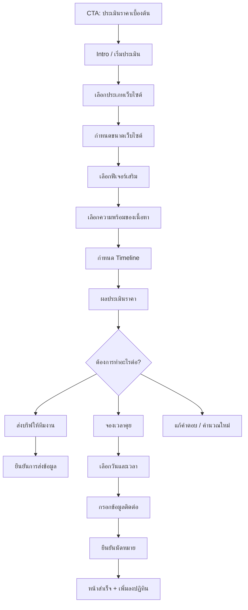

# Quote Estimator — User Flow และ UI Design

## 1. แนวคิดผลิตภัณฑ์

ระบบนี้คือเครื่องมือช่วยให้ผู้สนใจเข้าใจขอบเขตงานและช่วงราคาคร่าว ๆ ภายใน 2–4 นาที โดยไม่ทำให้ผู้ใช้รู้สึกเหมือนกำลังกรอกแบบฟอร์มขายของยาว ๆ เป้าหมายหลักคือทำให้ลูกค้าเห็นภาพว่า **ราคาเกิดจากอะไร** และพาไปสู่การคุยรายละเอียดกับทีมงานอย่างมีข้อมูลพร้อม

> ข้อความกำกับที่ควรแสดงในทุกหน้าผลลัพธ์: “ราคานี้เป็นการประเมินเบื้องต้นเพื่อใช้ประกอบการพูดคุย ราคาและขอบเขตงานจริงจะยืนยันหลังได้รับบรีฟและตรวจสอบรายละเอียดโปรเจกต์แล้ว”

ระบบควรใช้ภาษาที่เป็นมิตร ไม่สัญญาราคาตายตัว และไม่บังคับให้กรอกข้อมูลติดต่อก่อนเห็นผลประเมินในขั้นแรก

## 2. User Flow หลัก



### เส้นทางแบบสั้น

ผู้ใช้สามารถกด “เริ่มประเมิน” จาก Hero, แพ็กเกจ หรือส่วน Contact แล้วเข้าสู่หน้า estimator โดยระบบจำคำตอบระหว่างขั้นตอน เมื่อถึงผลลัพธ์ ผู้ใช้เลือกได้สามทาง ได้แก่ ส่งบรีฟ, จองเวลาคุย หรือย้อนกลับไปแก้คำตอบ โดยไม่ต้องเริ่มใหม่ทั้งหมด

### เส้นทางแบบกลับมาใช้งานต่อ

หากผู้ใช้ปิดหน้าเว็บระหว่างทำ ระบบควรเก็บคำตอบไว้ใน `sessionStorage` หรือ local storage ชั่วคราว และแสดงข้อความ “พบแบบประเมินที่ทำค้างไว้ ต้องการทำต่อหรือไม่?” เมื่อกลับเข้ามาอีกครั้ง การเก็บข้อมูลลักษณะนี้ไม่ควรบันทึกข้อมูลส่วนบุคคลก่อนผู้ใช้กดยินยอม

## 3. โครงสร้างขั้นตอนและคำถาม

| Step | คำถามหลัก                | รูปแบบ UI               | เหตุผลทางธุรกิจ                            |
| ---- | ------------------------ | ----------------------- | ------------------------------------------ |
| 0    | คุณกำลังมองหาอะไร        | Intro card + CTA        | สร้างความมั่นใจและอธิบายว่าใช้เวลาไม่นาน   |
| 1    | เว็บไซต์ประเภทใด         | Radio cards             | เลือกราคาฐานและชุดความต้องการเริ่มต้น      |
| 2    | ขนาดเว็บไซต์ประมาณเท่าไร | Segmented cards         | ประเมิน effort จากจำนวนหน้าและโครงสร้าง    |
| 3    | ต้องการฟีเจอร์อะไรบ้าง   | Checkbox cards          | บวกค่า add-on แบบโปร่งใส                   |
| 4    | มีเนื้อหาพร้อมแค่ไหน     | Radio cards             | แยกงานออกแบบ/พัฒนาออกจากงาน content        |
| 5    | ต้องการเปิดใช้งานเมื่อไร | Timeline cards          | ใช้ประเมินความเร่งด่วนและทรัพยากร          |
| 6    | ผลประเมิน                | Price range + breakdown | ให้ภาพรวมและทางเลือกถัดไป                  |
| 7    | ส่งบรีฟหรือจองคิว        | Form / calendar         | เปลี่ยนผู้สนใจเป็น lead ที่ทีมงานติดตามได้ |

### Step 0 — Intro

หน้าต้อนรับควรมีหัวข้อ “ลองดูว่าเว็บไซต์ของคุณน่าจะอยู่ช่วงไหน” คำอธิบายสั้น ๆ ว่าใช้เวลาประมาณ 2–4 นาทีและไม่ใช่ใบเสนอราคาสุดท้าย แสดงรายการสิ่งที่จะได้ เช่น ช่วงราคา ปัจจัยที่มีผล และคำแนะนำเบื้องต้น ปุ่มหลักคือ “เริ่มประเมิน” และปุ่มรอง “คุยกับทีมงานก่อน”

### Step 1 — ประเภทเว็บไซต์

แสดงการ์ดเลือก 4–5 ตัวเลือก ได้แก่ เว็บไซต์ธุรกิจ, Landing Page, ร้านค้าออนไลน์, Portfolio / Personal Brand และ “ยังไม่แน่ใจ” การ์ดแต่ละใบควรมีชื่อ คำอธิบายหนึ่งบรรทัด และ tag เช่น `MOST REQUESTED` โดยเลือกได้เพียงหนึ่งรายการ

### Step 2 — ขนาดเว็บไซต์

ถามจำนวนหน้าโดยไม่ใช้คำศัพท์เทคนิค เช่น “เว็บไซต์มีเนื้อหาประมาณกี่หน้า?” ตัวเลือกควรเป็น 1–5 หน้า, 6–10 หน้า, 11–20 หน้า และมากกว่า 20 หน้า / ต้องคุยรายละเอียด หากเลือกตัวเลือกสุดท้าย ระบบควรเปลี่ยนผลลัพธ์เป็น “ต้องประเมินเฉพาะโปรเจกต์” แทนการให้ช่วงราคาที่ดูแม่นเกินไป

### Step 3 — ฟีเจอร์เสริม

ใช้ checkbox card ที่เลือกได้หลายรายการ เช่น ระบบจอง, ระบบสมาชิก, เชื่อมชำระเงิน, เชื่อมต่อ API, SEO เบื้องต้น, เขียนเนื้อหา, ถ่ายภาพ/สร้างภาพประกอบ และหลายภาษา ใต้การ์ดควรมีข้อความ “เลือกเท่าที่รู้ตอนนี้ แก้ไขภายหลังได้” เพื่อไม่ให้ผู้ใช้กังวลว่าจะเลือกผิด

### Step 4 — ความพร้อมของเนื้อหา

ตัวเลือกควรใช้ภาษาที่เข้าใจง่าย ได้แก่ “มีเนื้อหาพร้อมแล้ว”, “มีบางส่วน ต้องช่วยจัดโครงสร้าง”, และ “ยังไม่มี ต้องการให้ช่วยตั้งแต่ต้น” คำตอบนี้มีผลต่อ effort แต่ไม่ควรทำให้ผู้ใช้รู้สึกถูกลงโทษด้วยราคาที่เพิ่มขึ้น จึงควรแสดงเป็นหมวด “งานที่รวมเพิ่ม” ในผลลัพธ์

### Step 5 — Timeline

ตัวเลือกคือ “ยังไม่กำหนด”, “ภายใน 2–3 เดือน”, “ภายใน 1–2 เดือน” และ “เร่งด่วนภายใน 1 เดือน” หากเลือกเร่งด่วน ควรแสดงข้อความว่าขึ้นกับคิวทีมงานและอาจมีค่าเร่งด่วนหลังตรวจสอบ scope แล้ว

## 4. กติกาการคำนวณราคา

### สูตรเชิงแนวคิด

```text
estimatedRange = basePrice
               + pageTierAdjustment
               + selectedFeatureAddOns
               + contentSupportAdjustment
               + languageAdjustment
               + urgencyAdjustment

displayMin = roundToNearestThousand(estimatedRange * 0.90)
displayMax = roundToNearestThousand(estimatedRange * 1.15)
```

สูตรจริงควรเก็บเป็น configuration แยกจาก component UI เพื่อให้เจ้าของธุรกิจแก้ราคาได้โดยไม่ต้องแก้โค้ดในอนาคต ระบบควรบันทึก `ruleVersion` ไปกับผลประเมินทุกครั้ง เพื่อให้ตรวจสอบย้อนหลังได้ว่าคำนวณจากตารางราคาเวอร์ชันใด

### หลักการแสดงผล

ไม่ควรแสดงรายการบวก/ลบแบบละเอียดจนเหมือนใบเสนอราคา แต่ควรจัดเป็น 3 กลุ่ม ได้แก่ “พื้นฐานของเว็บไซต์”, “สิ่งที่คุณเลือกเพิ่ม” และ “สิ่งที่ควรคุยเพิ่ม” แต่ละกลุ่มมีรายการสั้น ๆ พร้อมลิงก์ “ดูรายละเอียด” แบบ accordion

กรณีข้อมูลเกินขอบเขตที่สูตรรองรับ เช่น มากกว่า 20 หน้า, marketplace, ระบบซับซ้อน หรือการเชื่อมต่อเฉพาะทาง ให้แสดง `customEstimateRequired = true` พร้อมข้อความ “โปรเจกต์นี้น่าจะต้องประเมินเฉพาะทาง เราจะช่วยแตก scope ให้ชัดก่อนเสนอราคา” และ CTA ไปส่งบรีฟแทนการแสดงตัวเลขที่ทำให้เข้าใจผิด

## 5. รายละเอียดหน้าจอ UI

### Screen A — Estimator Landing

หน้าจอนี้ควรเปิดเป็นเส้นทางเฉพาะ เช่น `/estimate` แต่ยังใช้ Header และ Footer ชุดเดียวกับเว็บไซต์หลัก ด้านซ้ายเป็นหัวข้อแบบ editorial ขนาดใหญ่ ด้านขวาเป็น card สรุป 3 ขั้น: “ตอบคำถาม”, “เห็นช่วงราคา”, “เลือกคุยต่อ” ด้านล่างมี note เรื่องความเป็นส่วนตัวและราคาเบื้องต้น

**องค์ประกอบหลัก:** breadcrumb หรือ label `ESTIMATE / 001`, headline, supporting copy, primary CTA, secondary CTA, time estimate, privacy note และภาพ progress preview

### Screen B — Question Wizard

โครงสร้างหลักเป็นสองคอลัมน์บน Desktop: ด้านซ้ายแสดงหมายเลขขั้นและคำอธิบายสั้น ๆ ด้านขวาเป็นพื้นที่คำถาม ส่วนบนมี progress bar พร้อมข้อความ “ขั้นตอน 2 จาก 5” ด้านล่างมีปุ่ม “ย้อนกลับ” และ “ถัดไป” โดยปุ่มถัดไป disabled จนกว่าจะเลือกคำตอบที่จำเป็น

บน Mobile ให้แสดง progress bar ด้านบนและซ่อนคำอธิบายด้านข้างไว้ใน disclosure เพื่อเหลือพื้นที่ให้ card ตัวเลือก ปุ่มควรเป็น sticky bottom action bar ที่ไม่บังเนื้อหาและรองรับ safe area

**สถานะของการ์ดตัวเลือก:** default เป็นพื้น paper มีเส้นขอบบาง, hover ยกขึ้นเล็กน้อย, selected ใช้เส้น cobalt และพื้น cobalt อ่อน, focus ใช้ outline ที่มองเห็นชัด, disabled ลด opacity และมีคำอธิบายเหตุผล

### Screen C — Feature Selection

หน้าจอนี้ควรใช้ layout แบบ masonry หรือสองคอลัมน์ที่มีขนาดการ์ดต่างกันเล็กน้อย เพื่อคงเอกลักษณ์ Editorial Swiss Craft แต่ไม่ควรทำให้การเลือกยาก การ์ดที่เลือกควรมี checkmark และแสดง label สั้น ๆ เช่น `+ เพิ่ม effort` แทนการโชว์ราคาทันทีทุกใบ

ควรมี quick action “เลือกเฉพาะที่จำเป็น” และข้อความช่วยเหลือ “ไม่แน่ใจ? ข้ามได้ แล้วคุยกับทีมงานภายหลัง”

### Screen D — Estimate Result

นี่คือหน้าจอสำคัญที่สุด ควรมีผลลัพธ์แบบ visual hierarchy ชัดเจน: label `YOUR ROUGH RANGE`, ตัวเลขช่วงราคาขนาดใหญ่, คำอธิบายความมั่นใจของผลลัพธ์, และปุ่ม CTA สองทาง ได้แก่ “ส่งบรีฟให้ทีมงาน” กับ “จองเวลาคุย”

ใต้ผลลัพธ์ให้มี breakdown แบบ accordion, summary ของคำตอบ, สิ่งที่รวมอยู่, สิ่งที่ยังไม่รวม และ note ว่าราคาจริงยืนยันหลังคุย scope มีปุ่ม “แก้คำตอบ” ที่พากลับไปยัง step เดิมโดยรักษาคำตอบอื่นไว้

### Screen E — Lead Capture

ควรเก็บข้อมูลหลังผู้ใช้เห็นราคาแล้วเพื่อสร้างความรู้สึกโปร่งใส ฟิลด์ขั้นต่ำคือชื่อ/ชื่อแบรนด์, อีเมล, ช่องทางที่สะดวกให้ติดต่อ, รายละเอียดเพิ่มเติม และ checkbox ยินยอมให้ติดต่อกลับ ฟิลด์เบอร์โทรควรเป็น optional

ด้านข้างหรือด้านบนควรมี mini summary ของผลประเมิน เช่น “เว็บไซต์ธุรกิจ · 6–10 หน้า · ประมาณ 25,000–40,000 บาท” เพื่อให้ผู้ใช้มั่นใจว่ากำลังส่งข้อมูลชุดใด

### Screen F — Booking Handoff

ถ้าใช้ระบบจองภายนอก หน้านี้ควรแสดงข้อความชัดเจนว่า “ต่อไปคุณจะเลือกเวลาผ่านระบบนัดหมาย” และเปิดลิงก์หรือ embed พร้อมส่ง summary ผ่าน query/state ที่ไม่เปิดเผยข้อมูลส่วนตัวเกินจำเป็น

ถ้าสร้างระบบจองในตัว ให้แบ่งเป็น 3 ขั้นย่อย: เลือกประเภทการคุย, เลือกวันเวลา, กรอกข้อมูลติดต่อและยืนยัน โดยแสดงเขตเวลา `Asia/Bangkok` ชัดเจน และมีข้อความ fallback หากไม่มีช่วงเวลาว่าง

### Screen G — Success

หน้าสำเร็จควรแสดงหมายเลขอ้างอิง, สรุปช่วงราคา, วันเวลานัดหมายหรือสถานะการส่งบรีฟ, สิ่งที่จะเกิดขึ้นต่อไป และปุ่ม “กลับไปดูผลงาน” กับ “ดาวน์โหลดสรุป” หากมีระบบสร้างเอกสารในระยะถัดไป ไม่ควรใช้เพียงข้อความ “สำเร็จแล้ว” โดยไม่มี next step

## 6. Component inventory

| Component            | หน้าที่                  | States ที่ต้องรองรับ                      |
| -------------------- | ------------------------ | ----------------------------------------- |
| `EstimatorShell`     | layout หลักและ progress  | intro, wizard, result, success            |
| `ProgressRail`       | แสดงขั้นตอน              | active, complete, upcoming                |
| `OptionCard`         | เลือก radio/checkbox     | default, hover, selected, focus, disabled |
| `StepNavigation`     | ปุ่มย้อนกลับ/ถัดไป       | disabled, loading, submitting             |
| `EstimateSummary`    | แสดงช่วงราคาและสมมติฐาน  | normal, custom-review, error              |
| `BreakdownAccordion` | แสดงรายละเอียดการประเมิน | collapsed, expanded                       |
| `ContactCaptureForm` | รับข้อมูลติดต่อ          | idle, invalid, submitting, success        |
| `BookingCalendar`    | เลือก slot               | loading, available, unavailable, selected |
| `ResumeDraftDialog`  | ให้ทำต่อจากคำตอบเดิม     | resume, discard                           |
| `LanguageSwitcher`   | สลับ TH/EN               | active, focus                             |

## 7. Validation, loading และ error states

| สถานการณ์           | การตอบสนองของ UI                                         |
| ------------------- | -------------------------------------------------------- |
| ยังไม่เลือกคำตอบ    | ปิดปุ่มถัดไปและแสดง hint ใต้คำถาม                        |
| เปลี่ยนภาษา         | แปลข้อความทันทีและรักษาค่าที่เลือกไว้                    |
| คำนวณราคา           | แสดง skeleton/loader สั้น ๆ ไม่เกินความจำเป็น แล้วแสดงผล |
| ไม่มีข้อมูลราคา     | แสดง “ต้องคุยรายละเอียดกับทีมงาน” แทนการล้มเหลว          |
| ส่งบรีฟไม่สำเร็จ    | รักษาข้อมูลในฟอร์มและให้ลองส่งใหม่                       |
| อีเมลไม่ถูกต้อง     | แสดง error ใต้ field พร้อมข้อความแก้ไขได้                |
| ไม่มี slot ว่าง     | เสนอวันถัดไปหรือลิงก์ติดต่อทีมงาน                        |
| ผู้ใช้กดย้อนกลับ    | คำตอบเดิมต้องอยู่ครบ                                     |
| ผู้ใช้ refresh หน้า | เสนอ resume draft หากมีข้อมูลชั่วคราว                    |

## 8. Accessibility และ Responsive

ทุกตัวเลือกต้องใช้งานด้วย keyboard ได้ พร้อม focus ring ที่เห็นชัด ไม่ใช้สีเพียงอย่างเดียวในการสื่อว่า selected และควรใช้ semantic radio/checkbox หรือมี `role` และ `aria-checked` ที่ถูกต้อง ปุ่ม icon-only ต้องมี accessible label และ error message ต้องเชื่อมกับ field ด้วย `aria-describedby`

บน Desktop ใช้ layout rail + content ที่มี max width ชัดเจน บน Tablet ลด rail ให้เหลือ compact progress และบน Mobile ใช้ single-column cards, sticky navigation และปุ่ม action ขนาดแตะง่าย ควรรองรับ reduced motion โดยปิดการเลื่อนหรือ reveal ที่ไม่จำเป็นเมื่อผู้ใช้ตั้งค่า `prefers-reduced-motion: reduce`

## 9. Thai / English localization

ข้อความราคาและคำอธิบายควรมี dictionary แยกจาก logic ค่าจำนวนเงินใช้รูปแบบตาม locale แต่ต้องคงหน่วยบาทในทั้งสองภาษา เช่น `฿25,000–฿40,000` ภาษาอังกฤษใช้ตัวเลขอ่านง่ายและไม่ตัดคำกลางบรรทัด ชื่อ option ที่เป็นศัพท์เทคนิคควรมีคำอธิบายภาษาไทยกำกับในโหมด TH และคำอธิบายแบบ plain English ในโหมด EN

ไม่ควรเปลี่ยนคำตอบหรือรีเซ็ต wizard เมื่อสลับภาษา และควรเก็บภาษาที่เลือกใน local storage เช่นเดียวกับหน้าเว็บหลัก รวมถึงตั้งค่า `document.documentElement.lang` ให้ตรงกับภาษาปัจจุบัน

## 10. ข้อมูลและการพัฒนาตามระยะ

### MVP 1 — Client-side prototype

สร้าง wizard 5 ขั้น, กฎราคาแบบ config ใน frontend, result screen, แก้คำตอบ, รองรับ Thai/English และส่งต่อไปยัง Contact เดิม ระยะนี้ยังไม่เก็บ lead ลงฐานข้อมูล เหมาะสำหรับทดสอบว่าคำถามและช่วงราคาสื่อสารเข้าใจหรือไม่

### MVP 2 — Lead capture

เพิ่ม Backend และฐานข้อมูลเพื่อเก็บ quote request พร้อม `ruleVersion`, คำตอบ, ช่วงราคา, ภาษา และเวลาส่ง เพิ่ม success state และส่งอีเมลแจ้งทีมงาน โดยต้องมี loading/error state ครบ

### MVP 3 — Booking integration

เชื่อมต่อระบบจองภายนอกหรือระบบปฏิทินกลาง แล้วส่ง summary ของ estimator ไปกับเส้นทางจอง หากต้องการ booking ในตัว ให้เพิ่ม availability, appointments, conflict check และสิทธิ์จัดการสำหรับทีมงาน

### MVP 4 — Admin controls

เพิ่มหน้าจอให้ทีมงานแก้ราคาฐาน add-on, เปิด/ปิดคำถาม, ดู lead, เปลี่ยนสถานะ และ export ข้อมูล โดยควรมี audit trail ของการเปลี่ยนกฎราคาเพื่อไม่ให้ผลประเมินเก่าย้อนกลับไปคำนวณด้วยราคาปัจจุบันโดยไม่ตั้งใจ

## 11. Acceptance criteria

ระบบถือว่าพร้อมสำหรับ MVP เมื่อผู้ใช้สามารถเริ่มประเมินจากหน้าแรก ตอบคำถามครบ ย้อนกลับแก้ไขได้ เห็นช่วงราคาและ breakdown ที่เข้าใจได้ สลับภาษาโดยข้อมูลไม่หาย ส่งบรีฟต่อได้ และพบข้อความผิดพลาดที่แก้ไขได้เมื่อกรอกข้อมูลไม่ถูกต้อง ทั้ง Desktop และ Mobile ต้องใช้งานได้โดยไม่เกิด horizontal overflow

ก่อนเปิดใช้งานจริง ควรทดสอบชุดสถานการณ์อย่างน้อย 10 แบบ ตั้งแต่ Landing Page ขนาดเล็กไปจนถึงเว็บไซต์ที่มีหลายภาษา ระบบสมาชิก หรือความต้องการเกินขอบเขต เพื่อยืนยันว่าผลลัพธ์ไม่ทำให้ลูกค้าเข้าใจว่าเป็นใบเสนอราคาสุดท้าย

## 12. คำถามที่ต้องยืนยันก่อนเริ่ม build

1. ต้องการให้ estimator แสดงช่วงราคาเป็นเงินบาทเท่านั้นหรือรองรับสกุลเงินอื่นด้วย?
2. มีราคาฐานและค่า add-on ที่ต้องการใช้จริงแล้วหรือยัง?
3. ต้องการให้ลูกค้าเห็นผลราคาก่อนกรอกอีเมลหรือให้กรอกข้อมูลก่อน?
4. ต้องการทำ MVP แบบ client-side ก่อน หรือยกระดับเป็นระบบเก็บ lead ตั้งแต่เวอร์ชันแรก?
5. จะใช้ระบบจองภายนอกหรือให้ทีมงานจัดการ slot ในเว็บไซต์เอง?
6. มีบริการหลักที่ต้องการให้ CTA หลังผลลัพธ์พาไป เช่น นัดคุย 30 นาที, ส่งบรีฟ หรือขอใบเสนอราคา?
